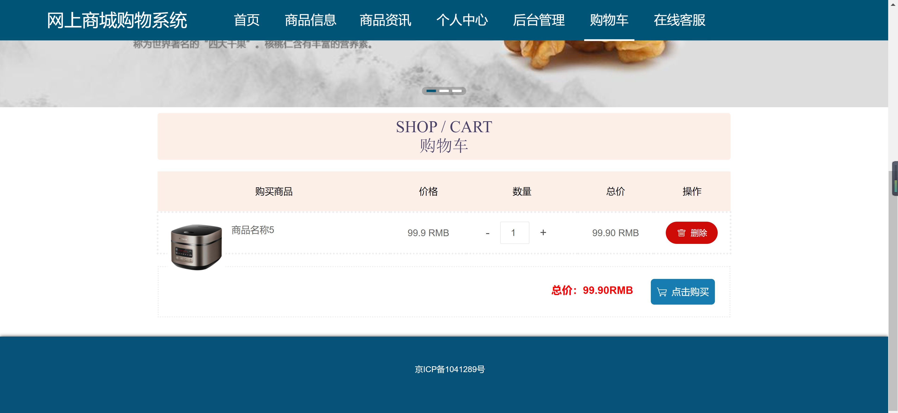
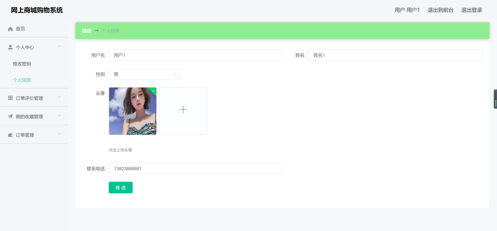

<h1 align="center">网上商城购物管理系统</h1>

## 简介
网上商城购物管理系统：角色分为管理员、用户；包含商品管理、订单管理、用户信息管理等功能，提供个人中心、购物车、商品展示、评价管理等模块，提升用户购物体验。    --计算机毕业设计源码；毕设源码；java毕业设计源码

## 联系方式

<h3 align="center">获取完整代码与数据库文件 + 微信：deepguan QQ: 86050149 QQ群: 783742310</h3>

<h3 align="center">可帮忙远程部署 包运行成功！提供远程部署、修改代码、设计文档指导、代码讲解等服务！</h3>

## 功能介绍（完整见运行截图）
管理员：管理员可以通过系统登录进行身份验证并访问管理员专属功能模块。首页提供快速导航，以便管理网站的各个部分，包括用户管理、商品分类和信息管理、以及订单和评价管理。管理员能够查看和更新商品信息，管理订单状态及用户评价，并执行商品分类的调整。个人中心支持管理员修改个人信息和密码，以确保账户安全。

用户：用户能够注册一个新账户或登录现有账户进入系统。导航栏便于用户快速浏览商品信息、查看个人购物车和访问个人中心。用户可以在个人信息管理界面修改个人资料，例如用户名、性别、联系方式，并能收藏商品及维护收藏信息。购物过程中，用户可查看商品详情、调整购物车中的商品数量，以及进行结算和购买操作，提升购物体验。

## 运行截图

本代码来源于网络,仅供学习参考使用!

